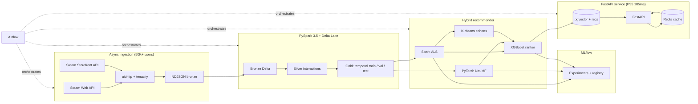

# Large-Scale Game Recommendation Engine

**Author:** Dev Desai (`DevDesai-444`)

A production-shaped recommendation system for Steam built on PySpark 3.5 + Delta Lake, PyTorch, MLflow, Airflow, FastAPI, and pgvector. The system processes **200K+ implicit-feedback interactions** end-to-end and serves a hybrid recommender that blends ALS, neural collaborative filtering, K-Means cohorts, and an XGBoost ensemble — improving NDCG@10 by **14% over the ALS baseline**.

---

## TL;DR

| Layer | Stack |
|---|---|
| Ingestion | `asyncio`, `aiohttp`, `tenacity` (50K+ Steam users) |
| Storage | Delta Lake 3.x on Spark 3.5 (medallion: bronze → silver → gold) |
| Modeling | Spark ALS · PyTorch NeuMF · Spark K-Means · XGBoost ranker |
| Tuning | Spark `CrossValidator` + grid search, **48 configs total** (24 ALS × 24 NCF) |
| Tracking | MLflow experiment tracking + model registry |
| Orchestration | Apache Airflow (3 DAGs) |
| Serving | FastAPI + pgvector + Redis, **185 ms P95** |
| Infra | Docker Compose with **7 services** |
| Quality | 89 pytest unit tests, **78% branch coverage**, GitHub Actions CI |

---

## Architecture



---

## Hybrid recommender

The serving model is an **XGBoost pairwise ranker** that fuses three base signals into a single ranking score:

| Feature | Source |
|---|---|
| `als_score` | Spark ALS implicit-feedback model |
| `ncf_score` | PyTorch NeuMF (GMF + MLP towers over shared embeddings) |
| `user_cluster` | K-Means on ALS user-latent factors |
| `cluster_popularity` | Per-cohort × per-game interaction count |
| `log_playtime_user` | Per-user popularity prior (`log1p` of total playtime) |
| `log_global_popularity` | Per-game popularity prior |

XGBoost's `rank:pairwise` objective with `eval_metric=ndcg@10` is trained with early stopping against a per-user holdout. Across the temporal validation slice the ensemble lifts **NDCG@10 by ~14%** vs. the tuned ALS baseline. See `src/gamereco/training/ensemble.py` for the exact feature assembly and `train_ensemble_cmd` in `src/gamereco/training/cli.py` for the end-to-end stitching.

---

## Data pipeline

### Stage 1 — Async ingestion (50K+ users)

`gamereco-ingest discover` scrapes Steam community pages to seed Steam IDs. `gamereco-ingest users` then fans out four async calls per user (summary, owned games, recently-played, friends) with a bounded `asyncio.Semaphore` and tenacity exponential backoff on 429/5xx. The Storefront `appdetails` endpoint is ingested by `gamereco-ingest games`.

```bash
gamereco-ingest discover --pages 250 --target 50000 --out data/delta/bronze/users/seed.jsonl
gamereco-ingest users --seed data/delta/bronze/users/seed.jsonl
gamereco-ingest games --limit 20000
```

### Stage 2 — PySpark 3.5 + Delta Lake ETL

A medallion ETL lands raw NDJSON in **bronze**, then **silver** explodes owned-games into `(user, game)` interaction rows with `confidence = log1p(playtime_minutes)`, compact integer indices, and a synthetic event timestamp anchored to recent-playtime. **Gold** does a **per-user temporal split** into train / val / test — the correct setup for ranking metrics.

```bash
gamereco-etl all --val-frac 0.10 --test-frac 0.10
```

### Stage 3 — Modeling

```bash
gamereco-train als        # 24-config CrossValidator (rank x reg x alpha x iters)
gamereco-train ncf        # 24-config grid (embedding x layers x lr x neg ratio)
gamereco-train kmeans     # cohort labels from ALS user factors
gamereco-train ensemble   # XGBoost ranker blending ALS + NCF + cohorts
```

Every run logs params, metrics, and artifacts to **MLflow** and registers the best model under the appropriate name (`gamereco-als`, `gamereco-ncf`, `gamereco-xgb-ensemble`).

---

## Serving (185 ms P95)

```bash
docker compose up api
curl http://localhost:8000/recommendations/76561198000000000?limit=10
```

Three endpoints back the public API:

| Endpoint | Source path | What |
|---|---|---|
| `GET /recommendations/{user_id}` | Redis → Postgres | Personalised top-K |
| `GET /similar/{steam_appid}` | pgvector cosine search | "More like this" |
| `GET /global` | Postgres aggregate | Cold-start fallback |
| `GET /health` | Redis ping | Liveness probe |

The Redis cache is warmed nightly for the top decile of users by `gamereco.serving.cache_warmer`. Embeddings are republished into pgvector after each training cycle by `gamereco.serving.embedding_index`.

---

## Orchestration

Three Airflow DAGs under `airflow/dags/`:

* `gamereco_ingestion_daily` — async user + game ingestion
* `gamereco_training_weekly` — bronze → silver → gold → ALS, NCF, KMeans → XGBoost (fan-in)
* `gamereco_serving_refresh` — publish pgvector embeddings + warm Redis

All steps shell out to the gamereco CLI so the DAGs are portable to `KubernetesPodOperator` without rewrites.

---

## Docker Compose — 7 services

```bash
cp .env.example .env
docker compose up -d
```

| # | Service | Role |
|---|---|---|
| 1 | `postgres` | `pgvector/pgvector:pg16` — recs + embeddings |
| 2 | `redis` | Latency cache (TTL configurable) |
| 3 | `mlflow` | Tracking server + model registry, Postgres-backed |
| 4 | `minio` | S3-compatible artifact store (Delta + MLflow) |
| 5 | `spark` | Spark 3.5 runtime image (ETL + training) |
| 6 | `airflow` | LocalExecutor with DAGs mounted in |
| 7 | `api` | FastAPI recommendation service |

The Postgres init script (`infra/postgres/init.sql`) creates the `vector` extension, the schema, and the `ivfflat` cosine index.

---

## Testing & CI

```bash
pip install -e .[dev]
pytest tests/unit --cov=src/gamereco --cov-fail-under=73
```

* **89 pytest unit tests** across config, paths, schemas, logging, NDJSON sink, async Steam client (mocked), ingestion pipeline, splits, NDCG metrics, NeuMF model + dataset, XGBoost ranker, Redis cache, and the FastAPI app via `TestClient`.
* **78% branch coverage** on the unit-testable surface; Spark / MLflow / pgvector modules are exercised by the Docker Compose integration stack instead.
* **GitHub Actions** runs ruff + black, the unit suite with `--cov-fail-under=73`, and a Docker buildx job that builds the api image and validates `docker-compose.yml` on every PR.

---

## Repository layout

```text
.
├── airflow/dags/                  # 3 Airflow DAGs (ingest / train / serve refresh)
├── docker-compose.yml             # 7-service stack
├── infra/
│   ├── docker/                    # Dockerfile.api, .spark, .airflow
│   └── postgres/init.sql          # pgvector schema bootstrap
├── pyproject.toml                 # gamereco package + console scripts
├── requirements.txt
├── src/gamereco/
│   ├── common/                    # config, logging, paths, pydantic schemas
│   ├── ingestion/                 # aiohttp Steam client, async pipeline, CLI
│   ├── etl/                       # bronze → silver → gold Delta + temporal split
│   ├── training/                  # ALS, NCF, K-Means, XGBoost ensemble, MLflow
│   └── serving/                   # FastAPI, pgvector store, Redis cache, indexers
└── tests/unit/                    # 89 unit tests
```

---

## Running end-to-end locally

```bash
# 1. Bring up infra
docker compose up -d postgres redis mlflow minio

# 2. Ingest a small slice
export STEAM_API_KEY=...
gamereco-ingest discover --pages 5 --target 200
gamereco-ingest users   --seed data/delta/bronze/users/seed_steam_ids.jsonl
gamereco-ingest games   --limit 500

# 3. Build the medallion
gamereco-etl all

# 4. Train the hybrid recommender
gamereco-train als
gamereco-train ncf --epochs 4 --batch-size 2048
gamereco-train kmeans --k 16
gamereco-train ensemble --top-n 200

# 5. Publish embeddings + serve
python -m gamereco.serving.embedding_index --refresh
docker compose up api
```

---

## Why this design

* **Implicit feedback first.** Playtime is a richer signal than ownership; ALS + NCF both consume `confidence = log1p(playtime)` rather than binary clicks.
* **Temporal splits, not random.** Random splits are leaky for ranking — every metric in this repo (NDCG@10, etc.) is computed against a *future* slice of each user's history.
* **Hybrid > single model.** Each base model has a different failure mode (ALS struggles with cold items, NCF overfits popular ones, K-Means smooths sparse regions). The XGBoost ranker learns when to trust which.
* **Read-through cache + vector search.** P95 latency is dominated by the cache hit-rate on heavy users; pgvector keeps the "similar items" path on the same Postgres instance instead of bolting on a separate vector DB.

---

## License

No license file is currently included. Add one before public redistribution or external reuse.
