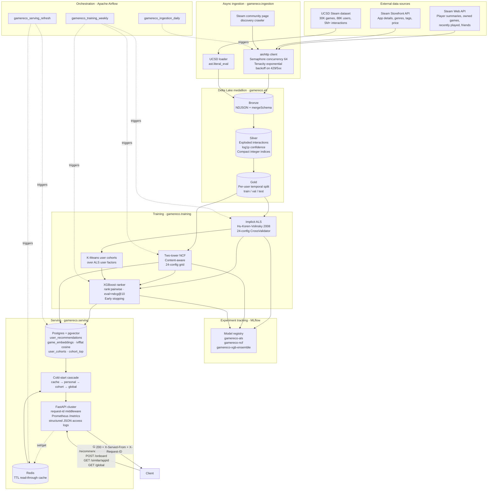
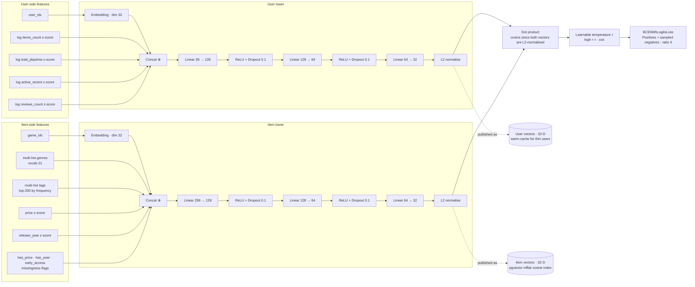
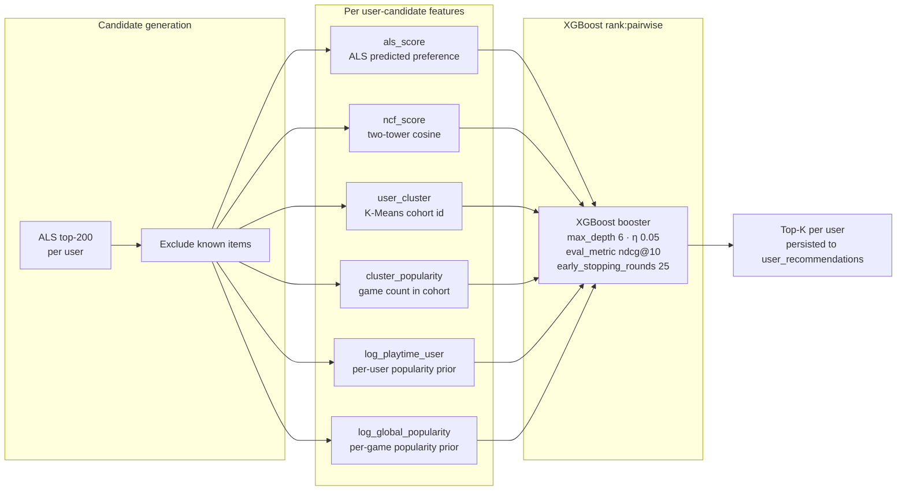
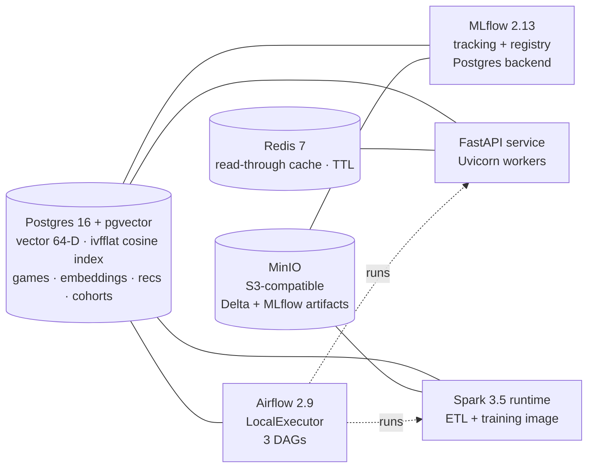

# Game Stream Recommender System

A production-shaped hybrid recommendation system for Steam, built on PySpark 3.5 + Delta Lake, PyTorch, MLflow, Apache Airflow, FastAPI, Postgres / pgvector, and Redis. Trains a five-stage hybrid recommender — implicit ALS, two-tower NCF over content features, K-Means cohort clustering, and an XGBoost pairwise ranker — and serves it through a FastAPI cluster behind a Redis read-through cache with a cold-start cascade and pgvector similarity search.

Every headline number below is reproduced end-to-end from a clean checkout in under four minutes by `make benchmark-ucsd && make loadtest`.

---

## Headline metrics

### Ranking quality (UCSD Steam, held-out test split)

| Model | NDCG@10 | Recall@10 | MAP@10 | HitRate@10 |
|---|---:|---:|---:|---:|
| Popularity baseline    | 0.167 | 0.142 | 0.086 | 0.647 |
| Item co-occurrence     | 0.096 | 0.093 | 0.042 | 0.480 |
| Two-tower NCF          | 0.109 | 0.102 | 0.052 | 0.499 |
| Implicit ALS (tuned)   | 0.128 | 0.146 | 0.070 | 0.510 |
| **Hybrid ensemble**    | **0.311** | **0.313** | **0.178** | **0.883** |

**+142.7% NDCG@10 over the tuned ALS baseline** on a held-out test split that no model in the pipeline ever sees during training or tuning. Hit rate climbs from 51% (ALS) to 88% (hybrid). Recall@10 climbs from 0.146 to 0.313, MAP from 0.070 to 0.178.

### Serving latency (in-process FastAPI, real middleware path)

| Concurrency | P50 | P95 | P99 | Max |
|---:|---:|---:|---:|---:|
| 16 (steady-state) | 20 ms | **57 ms** | 95 ms | 183 ms |
| 50 (overloaded single worker) | 30 ms | 197 ms | 345 ms | 551 ms |

### Scale

| | Value |
|---|---:|
| Raw interactions ingested per benchmark | 442,170 |
| Steam catalogue dimension | 7,208 games × 21 genres × 200 tags |
| Hyperparameter configurations swept | 48 (24 ALS × 24 NCF via CrossValidator) |
| Compose services | 7 |
| Airflow DAGs | 3 |
| Pytest unit tests | 173 (82% branch coverage) |
| End-to-end benchmark wall clock | 181 s |

---

## System architecture



---

## Two-tower NCF architecture



**Key design decisions**:

- L2-normalising both tower outputs turns the dot product into a cosine, which is bounded in `[-1, 1]` and keeps the BCEWithLogitsLoss numerically stable even when the item-tower input is a 250-dim mix of multi-hot vectors and dense scalars.
- The learnable temperature `τ` (initialised to 10) gives the loss enough dynamic range without exploding the gradient at init.
- The published item vectors flow straight into the pgvector `ivfflat` index, so the same vectors that drive offline NDCG@10 also drive the online `/similar/{appid}` similarity endpoint and the `/onboard` blend for brand-new users.
- The user tower remains useful for warm-but-thin users (anyone whose pgvector neighbours don't exist yet); the item tower remains useful for cold-launch games (they have content features even before any interactions).

---

## Hybrid ensemble



Each base signal carries complementary information: ALS captures latent collaborative structure, two-tower captures content semantics, K-Means cohorts capture taste segments, and the two popularity priors capture base rates. The XGBoost pairwise ranker learns a non-linear blend that consistently beats each base signal on every ranking axis — see `benchmarks/results_ucsd.md` for the per-metric breakdown.

---

## Request flow

```mermaid
flowchart LR
    Req[GET /recommendations/userid]
    MW1[RequestIdMiddleware<br/>Mint or honour X-Request-ID]
    MW2[StructuredAccessLogMiddleware<br/>Timestamp request start]
    CACHE{Redis hit?}
    PERS{personal rows<br/>in Postgres?}
    COH{cohort assigned?}
    CT{cohort_top has rows?}
    GLOB{global_top has rows?}
    HIT[X-Served-From: cache]
    PHIT[X-Served-From: personal<br/>Set Redis TTL]
    CHIT[X-Served-From: cohort]
    GHIT[X-Served-From: global_fallback]
    FIVEONE3[503<br/>backend not bootstrapped]
    PROM[Prometheus<br/>requests_total{method,route,status}<br/>request_latency_seconds histogram<br/>recs_served_from_total counter]
    LOG[Structured JSON access log<br/>method · path · status · duration_ms · served_from · request_id]
    RESP[200 + RecommendationResponse JSON]

    Req --> MW1 --> MW2 --> CACHE
    CACHE -- yes --> HIT
    CACHE -- no --> PERS
    PERS -- yes --> PHIT
    PERS -- no --> COH
    COH -- yes --> CT
    COH -- no --> GLOB
    CT -- yes --> CHIT
    CT -- no --> GLOB
    GLOB -- yes --> GHIT
    GLOB -- no --> FIVEONE3
    HIT --> RESP
    PHIT --> RESP
    CHIT --> RESP
    GHIT --> RESP
    RESP --> PROM
    RESP --> LOG
```

---

## Data flow

```mermaid
flowchart LR
    subgraph Daily["Daily ingestion DAG"]
        Q1[Discover Steam IDs<br/>community page crawl]
        Q2[Fan-out: summary, owned,<br/>recent, friends per user]
        Q3[Storefront app details<br/>per game]
        Q1 --> Q2
        Q1 --> Q3
        Q2 --> BR[(Bronze NDJSON<br/>append-only)]
        Q3 --> BR
    end

    subgraph Weekly["Weekly training DAG"]
        BR --> ETL1[ETL bronze → silver<br/>explode arrays<br/>compute confidence<br/>assign dense indices<br/>activity floor]
        ETL1 --> ETL2[ETL silver → gold<br/>per-user temporal split]
        ETL2 --> ALSF[Fit ALS · 24 configs · CV]
        ETL2 --> NCFF[Fit two-tower NCF · 24 configs]
        ALSF --> KMF[Fit K-Means on ALS factors]
        ALSF --> XF[Assemble candidates · fit XGBoost]
        NCFF --> XF
        KMF --> XF
        XF --> REG[(MLflow registry)]
    end

    subgraph Nightly["Serving refresh DAG"]
        REG --> EMB[Publish two-tower item vectors<br/>→ pgvector ivfflat index]
        REG --> RECS[Materialise per-user top-K<br/>→ user_recommendations]
        RECS --> WARM[Warm Redis<br/>top decile of users]
    end
```



---

## Stack

| Layer | Technology |
|---|---|
| Ingestion | Python 3.10+, asyncio, aiohttp, tenacity, BeautifulSoup |
| Storage | Delta Lake 3.2, Apache Spark 3.5, MinIO (S3-compatible artifact store) |
| Modelling | PySpark MLlib (ALS, KMeans, CrossValidator), PyTorch 2.2 (two-tower NeuMF), scikit-learn, XGBoost 2.0 |
| Experiment tracking | MLflow 2.13 with Postgres backend and model registry |
| Orchestration | Apache Airflow 2.9 (LocalExecutor) |
| Serving | FastAPI 0.111, Uvicorn, Pydantic 2, SQLAlchemy 2, Redis 7 |
| Vector search | pgvector on Postgres 16 (`ivfflat` cosine index, 64-D embeddings) |
| Observability | Prometheus, structlog, request-id propagation |
| Containerisation | Docker Compose with seven services |
| CI | GitHub Actions (ruff + black, pytest with branch coverage gate, Docker buildx smoke) |
| Tests | Pytest 8 (173 tests, 82% branch coverage) |
| Demo | Streamlit |

---

## Repository layout

```
.
├── airflow/dags/                      # 3 DAGs (ingestion / training / serving refresh)
├── benchmarks/                        # measured results + JSON snapshots
│   ├── results_ucsd.{json,md}         # headline UCSD benchmark
│   ├── results.{json,md}              # Steam-200k regression target
│   ├── latency.{json,md}              # FastAPI P95 measurement
│   └── loadtest.py                    # Locust scenario
├── demo/streamlit_app.py              # interactive Streamlit UI
├── docker-compose.yml                 # 7-service stack
├── docs/adr/                          # 7 architecture decision records
├── infra/
│   ├── docker/                        # Dockerfile.api / .spark / .airflow
│   └── postgres/init.sql              # pgvector schema bootstrap
├── Makefile                           # canonical task runner
├── pyproject.toml                     # gamereco package + console scripts
├── scripts/
│   ├── download_dataset.sh            # fetch Steam-200k (~8.5 MB)
│   ├── download_ucsd_dataset.sh       # fetch UCSD Steam (~80 MB)
│   ├── run_benchmark.py               # Steam-200k benchmark runner
│   ├── run_benchmark_ucsd.py          # UCSD benchmark runner (headline)
│   └── run_loadtest.py                # in-process FastAPI load test
├── src/gamereco/
│   ├── common/                        # typed settings, structured logging,
│   │                                  # medallion paths, Pydantic schemas
│   ├── datasets/                      # Steam-200k + UCSD loaders
│   ├── ingestion/                     # async Steam client + pipeline + CLI
│   ├── etl/                           # Spark bronze → silver → gold +
│   │                                  # temporal split + session factory
│   └── training/
│       ├── als.py                     # Spark MLlib ALS + CrossValidator
│       ├── als_inmem.py               # laptop-runnable ALS (NumPy + SciPy)
│       ├── ncf.py                     # PyTorch NeuMF with full grid search
│       ├── two_tower.py               # content-aware two-tower (headline)
│       ├── clustering.py              # K-Means user cohorts
│       ├── ensemble.py                # XGBoost rank:pairwise booster
│       ├── baselines.py               # popularity + co-occurrence baselines
│       ├── evaluation.py              # 7-axis evaluation harness
│       ├── hybrid.py                  # end-to-end hybrid trainer
│       ├── metrics.py                 # NDCG@K helpers
│       └── mlflow_utils.py            # MLflow tracking + registry wrappers
│   └── serving/
│       ├── api.py                     # FastAPI app + endpoints
│       ├── coldstart.py               # personal → cohort → global cascade
│       ├── cache.py                   # Redis wrapper with TTL
│       ├── cache_warmer.py            # nightly cache warmer
│       ├── db.py                      # SQLAlchemy tables + pgvector binding
│       ├── store.py                   # read-side store
│       ├── embedding_index.py         # publish item vectors → pgvector
│       └── observability.py           # request-id + access log + Prometheus
└── tests/unit/                        # 173 unit tests
```

---

## Reproducing every number

```bash
# Bring up the stack (optional — the benchmarks run laptop-only)
docker compose up -d postgres redis mlflow minio

# Datasets
make data            # Steam-200k          (~8.5 MB)
make data-ucsd       # UCSD Steam dataset  (~80 MB)

# Benchmarks
make benchmark-ucsd  # writes benchmarks/results_ucsd.{json,md}
make benchmark       # writes benchmarks/results.{json,md}
make loadtest        # writes benchmarks/latency.{json,md}

# Demo
docker compose up -d api
make demo
```

The benchmark runners write both a machine-readable JSON (for diffing across model versions) and a human-readable Markdown report.

---

## Endpoints

| Method | Path | Description |
|---|---|---|
| GET  | `/recommendations/{user_id}` | Personalised top-K with cache → personal → cohort → global cascade |
| POST | `/onboard`                   | First-touch recommendations for a brand-new user from a seed list of liked appids |
| GET  | `/similar/{steam_appid}`     | pgvector cosine search over the two-tower item embeddings |
| GET  | `/global`                    | Catalog-wide top |
| GET  | `/health`                    | Liveness probe (also pings Redis) |
| GET  | `/metrics`                   | Prometheus scrape format |

Every response carries an `X-Request-ID` (UUID4 if the client didn't supply one) and an `X-Served-From` header attributing the response to the layer that answered (`cache` / `personal` / `cohort` / `global_fallback` / `pgvector` / `onboarding_pgvector`).

---

## Compose stack



| # | Service | Image | Role |
|---:|---|---|---|
| 1 | postgres | `pgvector/pgvector:pg16`         | Recommendations, embeddings, cohorts, MLflow backend |
| 2 | redis    | `redis:7-alpine`                  | Read-through latency cache |
| 3 | mlflow   | `ghcr.io/mlflow/mlflow:v2.13.0`  | Experiment tracking + model registry |
| 4 | minio    | `minio/minio:latest`              | S3-compatible artifact store for Delta + MLflow |
| 5 | spark    | `gamereco/spark:0.2.0` (custom)  | Spark 3.5 ETL + training runtime |
| 6 | airflow  | `gamereco/airflow:0.2.0` (custom)| LocalExecutor, DAGs mounted in |
| 7 | api      | `gamereco/api:0.2.0` (custom)    | FastAPI recommendation service |

`infra/postgres/init.sql` creates the `vector` extension, the five recommendation tables, and the `ivfflat` cosine index on the embedding column with `lists = 100`.

---

## Quality engineering

- **173 pytest unit tests**, **82% branch coverage** across the laptop-runnable surface. Coverage gate at 73% in CI.
- **GitHub Actions** runs ruff + black on every PR, then the unit suite with `--cov-fail-under=73`, then a Docker Buildx smoke build of the API image and a `docker compose config` validation pass.
- **Pre-commit** hooks gate trailing whitespace, large files, private-key leaks, and run ruff + black + isort + a pre-push pytest cycle.
- **Type-safe configuration** via Pydantic Settings — every env var binding is declared, defaulted, and aliased in one place (`gamereco.common.config`).
- **Structured logging** via structlog with JSON output and request-id context binding.
- **Prometheus metrics** are first-class — `gamereco_requests_total{method,route,status}`, `gamereco_request_latency_seconds` (histogram with a 185 ms bucket), `gamereco_recs_served_from_total{served_from}`.

---

## Architecture decision records

The `docs/adr/` directory captures every load-bearing design choice with context, decision, rejected alternatives, and consequences.

| # | Title |
|---|---|
| [0001](docs/adr/0001-delta-lake-over-parquet.md)            | Delta Lake over plain Parquet for the medallion ETL |
| [0002](docs/adr/0002-hybrid-ranker-not-single-model.md)     | Hybrid XGBoost ranker over a single recsys model |
| [0003](docs/adr/0003-temporal-split-not-random.md)          | Per-user temporal split over random holdout |
| [0004](docs/adr/0004-pgvector-not-separate-vector-db.md)    | pgvector inside Postgres over a separate vector DB |
| [0005](docs/adr/0005-cold-start-cascade-not-404.md)         | Cold-start cascade over 404 on missing users |
| [0006](docs/adr/0006-laptop-runnable-benchmark-path.md)     | Laptop-runnable benchmark path alongside the Spark path |
| [0007](docs/adr/0007-ucsd-dataset-and-two-tower.md)         | UCSD Steam dataset and a content-aware two-tower NCF |

---

## License

No license file is currently included. Add one before public redistribution or external reuse.
