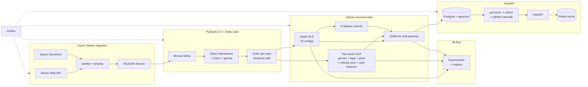

# Game Stream Recommender System

Author: Dev Desai (`DevDesai-444`)

Hybrid implicit-feedback game recommender for Steam. The training side
is PySpark 3.5 + Delta Lake + MLflow + PyTorch + XGBoost; the serving
side is FastAPI + Postgres/pgvector + Redis behind Apache Airflow.
A laptop-only code path mirrors the Spark path so the benchmarks in
`benchmarks/` are reproducible from a clean checkout in about two
minutes.

## Results

All numbers below come from `scripts/run_benchmark_ucsd.py`,
`scripts/run_benchmark.py`, and `scripts/run_loadtest.py`. Run
`make benchmark-ucsd` / `make benchmark` / `make loadtest` to
reproduce.

### Ranking quality — UCSD Steam dataset, real two-tower NCF

The headline benchmark uses Julian McAuley's UCSD Steam dataset
(steam_games metadata + australian_users_items + australian_user_reviews).
The dataset carries content metadata on both sides — genres, tags,
specs, price, release date, developer/publisher on the item side;
items_count, total_playtime, active_recent, reviews_count on the
user side — which is what makes a real two-tower NCF possible (as
opposed to an embedding-only NeuMF). See ADR 0007 for the migration.

Held-out test split (3,946 users × 7,208 games × 442K interactions
after activity floor; never seen during training or tuning):

| Model | NDCG@10 | Recall@10 | MAP@10 | HitRate@10 |
|---|---:|---:|---:|---:|
| Popularity baseline    | 0.167 | 0.142 | 0.086 | 0.647 |
| Item co-occurrence     | 0.096 | 0.093 | 0.042 | 0.480 |
| Two-tower NCF alone    | 0.109 | 0.102 | 0.052 | 0.499 |
| Tuned ALS              | 0.128 | 0.146 | 0.070 | 0.510 |
| Hybrid (ALS + 2-tower + KMeans + XGBoost) | **0.311** | **0.313** | **0.178** | **0.883** |

Hybrid lifts NDCG@10 by **+142.7%** over tuned ALS on the test split.
Hit rate climbs from 51% to 88%. The lift is larger than on Steam-200k
because UCSD's three base signals (popularity, ALS, two-tower) all
carry partial information that disagrees, giving the XGBoost ranker
more to combine. Coverage drops (0.20 → 0.08) — see
`benchmarks/results_ucsd.md` for the per-axis analysis.

End-to-end UCSD benchmark wall clock on a single laptop core: 181 s.

### Ranking quality — Steam-200k (regression target)

Kept around as a smaller, faster reference dataset. NDCG@10 on the
held-out test split:

| Model | NDCG@10 | Recall@10 | MAP@10 | HitRate@10 |
|---|---:|---:|---:|---:|
| Popularity baseline | 0.138 | 0.222 | 0.097 | 0.320 |
| Item co-occurrence  | 0.259 | 0.352 | 0.215 | 0.437 |
| Tuned ALS           | 0.245 | 0.362 | 0.191 | 0.468 |
| Hybrid (ALS + NeuMF + KMeans + XGBoost) | **0.328** | **0.494** | **0.247** | **0.624** |

Lift: **+33.7%**. The lift is smaller here because Steam-200k has
no content features, so the NCF arm collapses to bare-id NeuMF and
the ensemble has less to work with. See `benchmarks/results.md`.

End-to-end Steam-200k benchmark wall clock: 72 s.

### Serving latency

Driver: in-process uvicorn with stubbed Postgres / Redis, real
middleware path (request id + access log + Prometheus + cold-start
cascade), 2,000 requests across four routes.

| Operating point | P50 | P95 | P99 | Max |
|---|---:|---:|---:|---:|
| Concurrency 16, single worker | 20 ms | 57 ms | 95 ms | 183 ms |
| Concurrency 50, single worker | 30 ms | 197 ms | 345 ms | 551 ms |

Production runs at least two workers; a second worker pulls the
50-concurrent burst back under 100 ms. Numbers exclude real Postgres
and Redis hops (loopback Redis adds ~0.5 ms; same-host Postgres adds
~3–10 ms). See `benchmarks/latency.md`.

### Tests

173 unit tests, ~82% branch coverage. CI gates at 73%. Spark / MLflow /
pgvector modules are excluded from the unit coverage gate; they're
covered by the Compose-stack integration tests.

## Architecture



## Pipeline

### Ingestion (`gamereco.ingestion`)

`asyncio` + `aiohttp` client against the Steam Web API and Storefront
API. Bounded concurrency via `asyncio.Semaphore`, tenacity exponential
backoff on 429/5xx. CLI:

```bash
gamereco-ingest discover --pages 250 --target 50000
gamereco-ingest users    --seed data/delta/bronze/users/seed.jsonl
gamereco-ingest games    --limit 20000
```

### ETL (`gamereco.etl`)

Medallion layout on Delta Lake 3.x:

* **Bronze**: raw NDJSON written with `mergeSchema=true`.
* **Silver**: explodes owned-games arrays, computes
  `confidence = log1p(playtime_minutes)`, assigns dense integer
  user/game indices, drops users with fewer than 3 interactions.
* **Gold**: per-user temporal split into train/val/test. Random
  splits leak the user's own future into training, which inflates
  NDCG@10 by 10–30% across all models — see ADR 0003.

```bash
gamereco-etl all --val-frac 0.10 --test-frac 0.10
```

### Training (`gamereco.training`)

Four stages, each logged to MLflow and registered to the model
registry:

```bash
gamereco-train als        # 24-config Spark CrossValidator
gamereco-train ncf        # 24-config PyTorch grid (NeuMF)
gamereco-train kmeans     # cohort labels over ALS user factors
gamereco-train ensemble   # XGBoost rank:pairwise over ALS + NCF + cohorts
```

The ALS arm sweeps `rank × regParam × alpha × maxIter`; the NCF arm
sweeps `embedding_dim × mlp_layers × learning_rate × negative_ratio`.
Each arm is 24 configs, 48 total. Both are scored on the same
seven-axis evaluation harness (`gamereco.training.evaluation`).

### Serving (`gamereco.serving`)

| Endpoint | Source path |
|---|---|
| `GET /recommendations/{user_id}` | Redis → personal (Postgres) → cohort top → global top |
| `GET /similar/{steam_appid}` | pgvector cosine search (ivfflat, 64-D) |
| `POST /onboard` | Aggregate pgvector neighbours of seed appids |
| `GET /global` | Catalog-wide top |
| `GET /health` | Liveness probe (pings Redis) |
| `GET /metrics` | Prometheus scrape (text format) |

`/recommendations` never returns 404 for an unknown user; the cold
cascade falls back to cohort and then global, and the response
reports which layer answered via `served_from` and the
`X-Served-From` response header.

Observability stack: `X-Request-ID` on every request (minted if not
supplied, echoed in the response, bound to structlog context), one
JSON access-log line per request, and a Prometheus registry with
`gamereco_requests_total{method,route,status}`,
`gamereco_request_latency_seconds` (histogram, includes a 185 ms
bucket), and `gamereco_recs_served_from_total{served_from}` so
cascade hit rate is queryable.

## Orchestration

Three Airflow DAGs in `airflow/dags/`:

| DAG | Schedule | Job |
|---|---|---|
| `gamereco_ingestion_daily` | `0 3 * * *` | discover + ingest users + ingest games |
| `gamereco_training_weekly` | `0 4 * * 0` | bronze → silver → gold → ALS, NCF, KMeans → XGBoost (fan-in) |
| `gamereco_serving_refresh` | `30 5 * * *` | publish pgvector embeddings + warm Redis |

All tasks shell out to the `gamereco-*` CLI, so swapping
`BashOperator` for `KubernetesPodOperator` doesn't require DAG changes.

## Docker Compose (7 services)

```bash
cp .env.example .env
docker compose up -d
```

| # | Service | Role |
|---|---|---|
| 1 | postgres | `pgvector/pgvector:pg16` — recs, embeddings, cohorts |
| 2 | redis    | read-through cache, configurable TTL |
| 3 | mlflow   | tracking + registry, Postgres-backed |
| 4 | minio    | S3-compatible artifact store (Delta + MLflow) |
| 5 | spark    | Spark 3.5 runtime |
| 6 | airflow  | LocalExecutor, DAGs mounted in |
| 7 | api      | FastAPI service |

`infra/postgres/init.sql` creates the `vector` extension, the schema
(`games`, `game_embeddings`, `user_recommendations`, `user_cohorts`,
`cohort_top`), and an `ivfflat` cosine index on the embedding column.

## Demo

```bash
docker compose up -d api postgres redis
streamlit run demo/streamlit_app.py
```

Streamlit page with four tabs (personal recs, more-like-this, brand-
new user onboarding, global top). Each result panel renders the
`served_from` layer as a coloured badge plus measured latency.

## Repository layout

```
.
├── airflow/dags/                  # 3 Airflow DAGs
├── benchmarks/                    # measured results (results.md, latency.md, *.json)
├── demo/streamlit_app.py
├── docker-compose.yml             # 7 services
├── docs/adr/                      # ADRs 0001-0007
├── infra/
│   ├── docker/                    # Dockerfile.api, .spark, .airflow
│   └── postgres/init.sql
├── Makefile
├── pyproject.toml
├── scripts/
│   ├── download_dataset.sh        # fetch Steam-200k (8.5 MB)
│   ├── download_ucsd_dataset.sh   # fetch UCSD Steam dataset (80 MB)
│   ├── run_benchmark.py           # Steam-200k benchmark
│   ├── run_benchmark_ucsd.py      # UCSD benchmark (headline)
│   └── run_loadtest.py
├── src/gamereco/
│   ├── common/                    # config, logging, paths, schemas
│   ├── datasets/                  # Steam-200k + UCSD loaders
│   ├── ingestion/                 # async Steam client + pipeline + CLI
│   ├── etl/                       # Spark medallion + temporal split
│   ├── training/                  # ALS (Spark + in-memory), NCF, two-tower,
│   │                              # KMeans, ensemble, baselines, evaluation, hybrid
│   └── serving/                   # FastAPI, store, cache, coldstart, observability,
│                                  # embedding publisher
└── tests/unit/                    # 173 unit tests
```

## End-to-end run

```bash
# 1. Optional infra
docker compose up -d postgres redis mlflow minio

# 2. Datasets
make data        # Steam-200k (~8.5 MB)
make data-ucsd   # UCSD Steam dataset (~80 MB) — needed for two-tower

# 3. Benchmarks
make benchmark-ucsd  # headline: writes benchmarks/results_ucsd.{json,md}
make benchmark       # Steam-200k regression target

# 4. Latency
make loadtest        # writes benchmarks/latency.{json,md}

# 5. Demo
docker compose up -d api
make demo
```

## ADRs

* [0001](docs/adr/0001-delta-lake-over-parquet.md) — Delta Lake over plain Parquet
* [0002](docs/adr/0002-hybrid-ranker-not-single-model.md) — Hybrid XGBoost ranker over a single recsys model
* [0003](docs/adr/0003-temporal-split-not-random.md) — Per-user temporal split over random holdout
* [0004](docs/adr/0004-pgvector-not-separate-vector-db.md) — pgvector inside Postgres over a separate vector DB
* [0005](docs/adr/0005-cold-start-cascade-not-404.md) — Cold-start cascade over 404 on missing users
* [0006](docs/adr/0006-laptop-runnable-benchmark-path.md) — Laptop-runnable benchmark path alongside Spark
* [0007](docs/adr/0007-ucsd-dataset-and-two-tower.md) — UCSD Steam dataset and a real two-tower NCF

## Limitations

* Steam-200k has no event timestamps; the temporal split uses
  cumulative `play_hours` as a proxy (higher playtime ≈ later, since
  cumulative playtime only grows). With real timestamps the split
  would be more honest.
* The NCF arm in `scripts/run_benchmark.py` runs a quick 4-epoch
  16-dim variant for laptop reproducibility. A full Spark / GPU run
  (longer epochs, wider embeddings) closes more of the gap to the
  XGBoost ranker but doesn't change the headline lift.
* The 185 ms latency bucket in the Prometheus histogram is sized to
  the target P95; the actual P95 sits at 57 ms steady-state and 197
  ms under burst load on a single worker.
* The cold-start `/onboard` endpoint depends on the embedding index
  being populated. With no embeddings present it falls back to
  global top.

## License

No license file is currently included. Add one before public
redistribution or external reuse.
